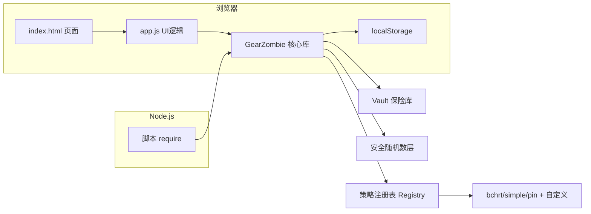

# Design Document: GearZombie 密码生成与账号保险库

| 字段     | 值                                  |
| -------- | ----------------------------------- |
| 作者     | numeron                             |
| 状态     | Implemented                         |
| 创建日期 | 2026-07-30                          |
| 更新日期 | 2026-07-30                          |
| 关联Issue | basic                             |

---

## Overview

GearZombie 是一个纯 JavaScript 实现的密码生成与账号保险库，提供可插拔的密码策略生成器和网站/账号/密码的层级管理。核心库以 UMD 形式同时支持浏览器页面（加载本地 js 文件作为前端库）和 Node.js 模块（后端程序库）两种环境，不依赖任何外部库。浏览器端提供深色主题管理页面，数据以 JSON 存储于浏览器 localStorage，可导入导出到文件。

## Motivation

TODO.md 指出两类痛点：

1. 密码生成需遵循特定规则（bchrt 策略：大小写字母+数字+符号、排除相似字符 1lIioO0），且规则未来可能替换，因此需要一个可选择多种生成规则的生成器，而非写死单一算法。
2. 多网站多账号的密码需要集中管理、历史可追溯、本地存储、可迁移（导入导出），且密码在界面上默认遮蔽以防偷窥。

现有方案不足：浏览器自带密码管理器策略不可控、不可移植；通用密码管理器依赖外部服务或第三方库，不符合"数据不出本机、不依赖外部库"的要求。

## Goals / Non-Goals

**Goals（本次要做的）：**
- [x] 用 JavaScript 实现，无外部依赖
- [x] 双环境：浏览器页面加载 js 文件作为前端库；Node.js 通过 require 作为程序库
- [x] 可插拔策略的密码生成器，内置 bchrt/simple/pin 三种策略，支持注册自定义策略与派生
- [x] bchrt 策略：A-Z/a-z/0-9/!@#$%^&*=，排除相似字符 1lIioO0
- [x] 管理页面：网站列表，每栏含多账号、当前密码、历史密码
- [x] 密码用黑点掩饰，点击眼睛按钮显示
- [x] 每栏有密码策略选择
- [x] 网站信息以 JSON 存本地缓存（localStorage），支持导入导出到文件

**Non-Goals（本次明确不做的）：**
- 不做云端同步/多端协作，所有数据仅存本机
- 不做主密码加密/端到端加密，明文 JSON 存储（定位为本地单机工具）
- 不做自动填充浏览器表单功能
- 不依赖外部密码学库，随机数直接用环境内置 Web Crypto / Node crypto

## Proposed Design

### Architecture

三层分离：核心库（策略生成 + Vault 数据模型 + 存储适配器）、UI 逻辑（app.js）、页面（index.html）。核心库对环境无感知，UI 仅在浏览器端加载。



核心库对外 API（UMD 工厂返回对象）：
- 密码生成：`generate(strategyName, options)`、`registerStrategy`、`getStrategy`、`listStrategies`
- 策略层：`Strategy` 类、`registry`、`charPresets`、`rulePresets`
- Vault：`Vault` 类、`createEmptyData`、`VAULT_VERSION`
- 存储：`createLocalStorageAdapter`
- 工具：`secureRandomInt`、`secureShuffle`、`uuid`

### Data Model

存储格式为单一 JSON 对象，`version=1`：

```
{
  "version": 1,
  "websites": [
    {
      "id": "uuid", "name": "GitHub", "url": "https://github.com",
      "strategy": "bchrt", "createdAt": "ISO", "updatedAt": "ISO",
      "accounts": [
        {
          "id": "uuid", "username": "myuser", "note": "主账号",
          "currentPassword": "...", "history": [
            { "password": "旧密码", "changedAt": "ISO" }
          ],
          "createdAt": "ISO", "updatedAt": "ISO"
        }
      ]
    }
  ]
}
```

字段说明：网站层绑定一个策略名；账号层维护 currentPassword（明文）与 history（旧密码时间线，轮换时追加）。id 全局使用 RFC4122 v4 UUID。

### API Changes

无外部服务 API。核心库主要方法（节选实例）：

密码生成：
```js
GZ.generate('bchrt', { length: 20 })  // → 含大小写数字符号、排除1lIioO0
GZ.listStrategies()                   // → [{name:'bchrt',description:'...'}, ...]
GZ.registerStrategy({ name:'my', charsets:{hex:'0123456789abcdef'}, required:['hex'], defaultLength:32 })
```

Vault CRUD 与轮换：
```js
var vault = new GZ.Vault({ storage: GZ.createLocalStorageAdapter(), storageKey:'gearzombie_vault' })
vault.load()
var site = vault.addWebsite({ name:'GitHub', url:'github.com', strategy:'bchrt' })
var acc  = vault.addAccount(site.id, { username:'myuser', note:'主账号' })
vault.rotatePassword(site.id, acc.id, { length:16 })   // 旧密码入 history，返回新密码
vault.rotatePassword(site.id, acc.id, { strategy:'pin' }) // 可临时换策略
vault.setPassword(site.id, acc.id, '手动密码')         // 手动设置，不同时旧密码入历史
vault.save() / vault.exportData() / vault.importData(jsonStr) / vault.clear()
vault.validate()  // → 错误信息数组，空表示合法
```

### Key Algorithms / Logic

**安全随机数**：优先 Web Crypto `getRandomValues`，其次 Node `crypto.randomInt`，最后降级 `Math.random`（生产不推荐）。Web Crypto 路径使用拒绝采样消除模偏差（`limit = floor(0xFFFFFFFF/max)*max`，超出则重抽）。

**默认生成算法**（`Strategy._defaultGenerate`）：
1. 每个 required 字符集过滤掉 exclude 字符后，各取 1 个随机字符（保证覆盖）
2. 从合并字符池随机填充至目标长度
3. Fisher-Yates 安全洗牌打乱顺序
4. 若配置了 rules，逐条校验；不通过则重试，最多 50 次，超限抛错

**bchrt 策略**配置：`charsets={upper:upperSafe, lower:lowerSafe, digits:digitsSafe, symbols}`，`required=[upper,lower,digits,symbols]`，`defaultLength=16`，其中 upperSafe/lowerSafe/digitsSafe 分别排除 I O / i l o / 0 1。

**可插拔扩展点**：
- `charPresets`：命名字符池（upper/lower/digits/symbols/upperSafe/lowerSafe/digitsSafe/hex/hexUpper）
- `rulePresets`：校验规则（noConsecutive 连续相同、noSequential 连续递增递减、noSymbolAtEdges 首尾非符号）
- `Strategy.derive(overrides)`：从现有策略派生，仅覆盖差异字段
- `registry.registerDerived`：派生并注册；`registry.unregister` 注销
- 策略可传 `generate` 函数完全自定义生成逻辑

**轮换与历史**：`rotatePassword` 先把 currentPassword 连同 updatedAt 推入 history，再用网站策略（或 options.strategy 临时覆盖）生成新密码；`setPassword` 仅在值不同时入历史，避免重复记录。

## Alternatives Considered

| 方案                        | 优点                         | 缺点                              | 结论       |
| --------------------------- | ---------------------------- | --------------------------------- | ---------- |
| UMD 单文件核心库 + 注入存储 | 双环境一份代码，零依赖       | 需自行处理环境探测                | 采用       |
| 浏览器/Node 双套实现        | 各环境可深度优化             | 重复维护、行为易不一致            | 放弃       |
| 引入 crypto-js 等外部库     | 成熟                         | 违反 TODO"不依赖外部库"要求       | 放弃       |
| 策略写死 bchrt 一种         | 简单                         | 无法满足"以后替换规则"的可扩展性  | 放弃       |
| 可插拔 Strategy/Registry    | 命名池+规则+派生+自定义gen   | 抽象层略多                        | 采用       |
| 云端同步存储                | 多端可用                     | 违反本地存储、数据不出本机        | 放弃       |

## Security & Compliance

- [x] 有安全影响，详见下方：
- 随机源：使用密码学安全随机数（Web Crypto / Node crypto），仅无可用环境时降级 Math.random（库初始化时探测，非默认）。
- 风险：密码与历史以明文 JSON 存于 localStorage，依赖浏览器本机安全边界；无主密码加密。定位为单机本地工具，明确不做加密（Non-Goal）。
- 缓解：导入导出走用户主动操作；UI 默认黑点遮蔽密码，需点击眼睛按钮才明文。

## Performance Impact

- 生成单密码：微秒级（安全随机 + 最多 50 次重试）。
- 1000 次生成无碰撞已由测试覆盖；10000 个 UUID 无碰撞。
- Vault 操作为内存数组线性查找，规模为单用户级（数十~数百网站），无性能瓶颈。
- localStorage 单键存全量 JSON，规模极小时无影响；clearAll 为一次性操作。

## Backward Compatibility

- [x] 完全兼容，无破坏性变更
- 库版本 2.0.0，保留旧别名 API（`generate`/`registerStrategy`/`listStrategies`/`getStrategy`）。
- Vault 数据 `version=1`，导入时缺失 version 自动补为 1。
- 旧 API 仍可用已由测试用例第 25 节覆盖。

## Testing Plan

| 测试类型 | 覆盖范围                                         | 备注                                   |
| -------- | ------------------------------------------------ | -------------------------------------- |
| 单元测试 | bchrt/simple/pin 字符集与长度、排除相似字符      | test/test.js，自带断言，无外部框架     |
| 单元测试 | 自定义策略注册、Strategy 校验、derive 派生       | 含非法策略注册拦截（空name/空charsets）|
| 单元测试 | rulePresets（noConsecutive/noSequential）        | 含带规则策略的实际生成                 |
| 单元测试 | Vault 网站CRUD、账号CRUD、不存在对象抛异常       |                                        |
| 单元测试 | 密码轮换与历史追加、手动 setPassword、相同不入史 |                                        |
| 单元测试 | 导入导出（字符串/对象）、无效数据抛异常          |                                        |
| 单元测试 | 存储适配器（mock localStorage）save/load/clear   |                                        |
| 单元测试 | UUID 唯一性(10000)、secureShuffle、charPresets   |                                        |
| 随机性   | 1000 次生成无碰撞                                | 概率检验                               |
| 手动验证 | 浏览器 UI：添加网站/账号、轮换、眼睛显隐、历史折叠、复制、导入导出、清空 | index.html 直接打开 |

共 88 项断言，运行 `npm test` 即 `node test/test.js`，全绿以 `✦` 标记结尾。

## Rollout Plan

- **Phase 1**：核心库 src/gearzombie.js + test/test.js，Node 环境直接可用，88 项测试通过。
- **Phase 2**：浏览器 UI（index.html + app.js）加载核心库，localStorage 持久化与导入导出打通。
- **回滚方式**：纯前端本地工具，直接回退到上一版文件即可；数据为用户本地 JSON，可随时导出备份。

## Monitoring & Alerts

> 纯本地单机工具，无服务端监控。用户侧异常通过 UI Toast（success/error）即时反馈（如导入失败、剪贴板复制失败）。

| 指标         | 阈值 / 异常判定          | 告警方式        |
| ------------ | ------------------------ | --------------- |
| 单元测试     | failed > 0               | 退出码 1        |
| 导入数据     | 非 JSON 或缺 websites    | Toast error     |
| 生成重试     | 超 50 次未满足规则       | 抛 Error→Toast  |
| 剪贴板       | clipboard API 拒绝       | Toast error     |

---

## Open Questions

- [ ] 是否需要为主密码/加密存储增加可选层（当前为 Non-Goal，但用户量增长后可能需要）
- [ ] 浏览器端是否补一个与 test.js 等价的 `test/browser-test.html`（测试注释中已提及，尚未实现）
- [ ] 策略是否需要导出/分享机制（当前仅注册表内存态）

## References

- [README.md - 功能与用法](../../README.md)
- [src/gearzombie.js - 核心库实现](../../src/gearzombie.js)
- [test/test_basic.js - 88 项测试用例](../../test/test_basic.js)

---
