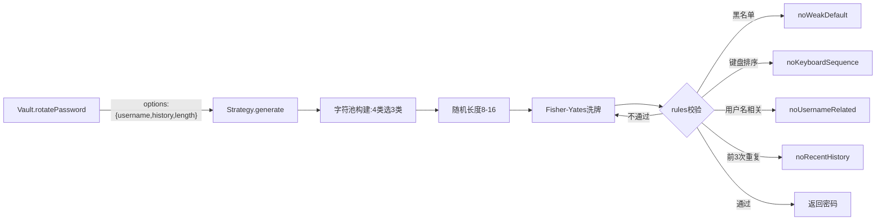

# Design Document: am-cloud 密码策略

| 字段     | 值                                  |
| -------- | ----------------------------------- |
| 作者     | numeron                             |
| 状态     | Implemented                         |
| 创建日期 | 2026-07-30                          |
| 更新日期 | 2026-07-30                          |
| 关联Issue | am-cloud密码策略                   |

---

## Overview

在现有可插拔策略架构上新增 `am-cloud` 密码策略。该策略面向云平台/网络设备通行字管理，遵循等保合规要求：长度 8-16、四类字符至少三类、禁用默认弱口令黑名单、避免键盘排序、与用户名无相关性、不能与前 3 次历史密码相同。由于多项规则需要外部上下文（用户名、历史密码），本策略需扩展生成器接口以传入上下文参数，并新增若干校验规则。

## Motivation

TODO.md 提出的 am-cloud 策略与现有 bchrt/simple/pin 有本质差异：

1. **长度范围而非固定值**：8-16 可变，现有 `Strategy` 仅支持单一 `defaultLength`。
2. **"至少 N 类"而非"全部必选"**：四类中取三类，现有 `required` 语义是"每个必选集各取 1"。
3. **上下文相关校验**：不能与前 3 次密码相同、不得包含用户名——这两条需要生成时传入 `username` 和 `history`，现有 `generate(options)` 仅接受 `length`。
4. **黑名单与键盘排序**：需要新的规则函数，现有 `rulePresets` 未覆盖。

现有方案的不足：Strategy 的 `required` 字段强约束"每类都必须出现"，无法表达"至少 3 类"；`generate` 无历史/用户名参数，无法做上下文校验。因此需要对策略配置和生成接口做增量扩展。

## Goals / Non-Goals

**Goals（本次要做的）：**
- [x] 新增 `am-cloud` 策略，注册到 registry，UI 策略下拉可见
- [x] 支持 8-16 可变长度（每次随机选取区间内长度）
- [x] 四类字符（数字/小写/大写/特殊符号）至少出现三类
- [x] 禁用默认弱口令黑名单（admin/root/huawei/cisco/123456/111111 等及包含关系）
- [x] 避免键盘排序密码（如 qwerty/123456/asdfgh 正反向）
- [x] 与用户名无相关性（不含用户名完整串、大小写变位、形似变换）
- [x] 不能与前 3 次历史密码相同
- [x] 扩展 `generate(options)` 支持传入 `username`、`history`、`minLength`/`maxLength`
- [x] 新增对应 rulePresets，可被其他策略复用
- [x] 补充测试用例

**Non-Goals（本次明确不做的）：**
- 不做口令过期强制轮换策略（仅校验"不与前 3 次相同"，轮换时机由用户/UI 决定）
- 不做服务端集中管控，校验全部在本地生成时完成
- 不修改现有 bchrt/simple/pin 策略的行为
- 不对特殊符号集合做扩展（沿用 `!@#$%^&*=` ）

## Proposed Design

### Architecture

am-cloud 策略复用现有 Strategy 类 + registry，通过自定义 `generate` 函数实现"至少 N 类"与可变长度，通过 `rules` 数组叠加黑名单/键盘排序/用户名相关性校验。历史密码与用户名经 `options` 传入生成器。



### Data Model

策略配置不变，仍为 Strategy 实例。新增字段说明：

```js
{
  name: 'am-cloud',
  description: '等保合规：8-16位，四类至少三类，禁弱口令/键盘序/用户名相关/前3次重复',
  charsets: {
    upper: charPresets.upperSafe,
    lower: charPresets.lowerSafe,
    digits: charPresets.digitsSafe,
    symbols: charPresets.symbols
  },
  // 新增：最少需要的字符类数（四类中至少 N 类）
  minCategories: 3,
  // 新增：长度范围
  minLength: 8,
  maxLength: 16,
  rules: [noWeakDefault, noKeyboardSequence, noUsernameRelated, noRecentHistory],
  generate: customGenerate  // 自定义生成逻辑
}
```

### API Changes

**扩展 `generate(options)` / `Strategy.generate(options)` 的 options：**

| 字段       | 类型     | 说明                           | 新增 |
| ---------- | -------- | ------------------------------ | ---- |
| length     | number   | 指定长度（优先级高于范围）     | 否   |
| minLength  | number   | 最小长度（am-cloud=8）         | 是   |
| maxLength  | number   | 最大长度（am-cloud=16）        | 是   |
| username   | string   | 当前账号用户名，用于相关性校验 | 是   |
| history    | string[] | 最近 N 次历史密码              | 是   |

调用示例：

```js
// Vault 内部调用时自动传入 username 和 history
vault.rotatePassword(siteId, accId, {
  strategy: 'am-cloud',
  username: acc.username,
  history: acc.history.slice(-3).map(h => h.password)
})

// 直接调用
GZ.generate('am-cloud', {
  minLength: 8, maxLength: 16,
  username: 'admin', history: ['OldPw123!', 'Prev456#']
})
```

**Vault.rotatePassword 改造**：当策略需要上下文时，自动从 account 中提取 `username` 和最近 3 条 `history` 注入 options。

**新增 rulePresets：**

| 规则名                | 校验内容                                         | 需要 options 字段 |
| --------------------- | ------------------------------------------------ | ----------------- |
| `noWeakDefault`       | 不含黑名单词（admin/root/huawei/cisco/123456…）  | 无                |
| `noKeyboardSequence`  | 无键盘连续序列（横排/竖排，正反向，≥3字符）      | 无                |
| `noUsernameRelated`   | 不含用户名完整串、大小写变位、形似变换（0→o,1→l）| username           |
| `noRecentHistory`     | 不等于最近 N 次历史密码                          | history           |

> 现有 `rules` 的 `validate(password)` 签名需扩展为 `validate(password, options)`，options 透传 generate 上下文。旧规则不读 options 则向后兼容。

### Key Algorithms / Logic

**1. 可变长度**：`length = options.length || secureRandomInt(maxLength - minLength + 1) + minLength`

**2. 至少 N 类字符**：
- 从 4 类中随机选 `minCategories` 类作为 required，每类取 1 个
- 剩余长度从 4 类合并池填充
- 洗牌

**3. 黑名单校验 `noWeakDefault`**：
- 维护黑名单表：`['admin','root','huawei','cisco','123456','111111','password','pass','guest','default','test','user','operator','admin123']`
- 校验：密码不等于黑名单词、不包含黑名单词（大小写不敏感）

**4. 键盘排序校验 `noKeyboardSequence`**：
- 定义键盘行序列：`qwertyuiop`、`asdfghjkl`、`zxcvbnm`、`1234567890`
- 检测密码中是否含任意行内 ≥3 字符的正向或反向连续子串（如 `qwe`、`654`、`asd`）

**5. 用户名相关性校验 `noUsernameRelated`**：
- 完整匹配：密码不含 username（大小写不敏感）
- 变位匹配：密码不含 username 的大小写排列子串（如 `AdMiN`）
- 形似变换：将 username 做 `o→0, l→1, i→1, e→3, a→@, s→$` 替换后，检查密码是否包含该变形串

**6. 历史 N 次不重复 `noRecentHistory`**：
- 取 `options.history` 最后 3 条，密码严格不等于其中任意一条

**7. 生成重试**：沿用现有最多 50 次重试机制；若规则过严导致超限，抛出明确错误提示放宽容差。

## Alternatives Considered

| 方案                                    | 优点                       | 缺点                              | 结论       |
| --------------------------------------- | -------------------------- | --------------------------------- | ---------- |
| 自定义 generate + 扩展 rules 签名       | 复用现有架构，规则可复用   | rules 签名变更需兼容旧规则        | 采用       |
| 独立 AmCloudStrategy 子类               | 逻辑内聚                   | 绕过注册表，与可插拔设计冲突      | 放弃       |
| Vault 层做历史/用户名校验，策略只生成   | 策略简单                   | 校验与生成分离，重试无法闭环      | 放弃       |
| 固定长度 16（忽略 8-16 范围）           | 无需改长度逻辑             | 不满足 TODO"8-16"要求             | 放弃       |
| 四类全必选（忽略"至少3类"）             | 复用 required 字段         | 违背"至少3类"宽松要求             | 放弃       |

## Security & Compliance

- [x] 有安全影响，详见下方：
- am-cloud 策略本身即为安全合规需求（等保通行字要求），生成时即满足多项硬性约束。
- 弱口令黑名单为静态内置，可通过代码更新扩展。
- 历史密码校验依赖 Vault 明文存储的 history，与现有存储模型一致（Non-Goal: 不加密）。
- 用户名形似变换规则有限（o/0、l/1、i/1、e/3、a/@、s/$），不能覆盖所有社工变形，但满足 TODO 要求的"形似变换"基线。

## Performance Impact

- 生成单密码：自定义 generate 内 4 选 3 + 洗牌，微秒级。
- rules 校验中 `noUsernameRelated` 的形似变换涉及字符串替换与子串搜索，但用户名通常 <20 字符，开销可忽略。
- 50 次重试上限不变；am-cloud 约束空间充足（8-16 位 × 四类），实际碰撞重试极少。
- 黑名单表为静态数组，线性扫描 O(n×m)，n≈14 词，无性能问题。

## Backward Compatibility

- [x] 完全兼容，无破坏性变更
- `rules` 的 `validate` 签名从 `validate(pw)` 扩展为 `validate(pw, options)`，旧规则不读 options 参数即自动兼容。
- `generate(options)` 新增字段均为可选，不传时 am-cloud 用默认值（minLength=8/maxLength=16，username=''，history=[]）。
- 现有 bchrt/simple/pin 逻辑不变。
- Vault.rotatePassword 新增自动注入逻辑仅在策略声明需要上下文时生效（可通过 Strategy 配置 `needsContext: true` 开关控制）。

## Testing Plan

| 测试类型 | 覆盖范围                                         | 备注 |
| -------- | ------------------------------------------------ | ---- |
| 单元测试 | am-cloud 长度始终在 8-16 区间                    | 1000 次生成区间统计               |
| 单元测试 | 四类字符至少出现三类                             | 每次生成后分类计数               |
| 单元测试 | noWeakDefault：黑名单词及包含被拒绝              | 含 admin/Admin/ADMIN123 等       |
| 单元测试 | noKeyboardSequence：qwe/654/asd 被拒绝           | 正反向各测                       |
| 单元测试 | noUsernameRelated：含用户名/变位/形似被拒绝      | username='admin' 多场景          |
| 单元测试 | noRecentHistory：与历史密码相同被拒绝            | 传入 history 数组               |
| 边界测试 | minLength=8 能生成、maxLength=16 不超长          |                                  |
| 集成测试 | Vault.rotatePassword 使用 am-cloud 自动注入上下文| 网站策略设为 am-cloud            |
| 集成测试 | 旧规则 validate(pw) 不传 options 仍正常          | 回归 noConsecutive 等            |
| 手动验证 | UI 下拉选择 am-cloud，生成并轮换密码             | index.html                       |

## Rollout Plan

- **Phase 1**：在 `src/gearzombie.js` 中扩展 Strategy 配置字段（minCategories/minLength/maxLength/needsContext）、扩展 rules.validate 签名、新增 4 个 rulePresets。
- **Phase 2**：实现 am-cloud 自定义 generate，注册到 registry。
- **Phase 3**：改造 Vault.rotatePassword 在 needsContext 时注入 username/history。
- **Phase 4**：补充测试用例，UI 自动可见（策略下拉已动态读取 registry.list）。
- **回滚方式**：`registry.unregister('am-cloud')` 即可移除；核心改动为增量式，不影响现有策略。

## Monitoring & Alerts

> 纯本地库，无运行时监控。开发期通过测试退出码判定。

| 指标           | 阈值 / 异常判定                      | 告警方式        |
| -------------- | ------------------------------------ | --------------- |
| 单元测试       | failed > 0                           | 退出码 1        |
| 生成重试超限   | 50 次未满足 am-cloud 全部规则        | 抛 Error→Toast  |
| 历史上下文缺失 | needsContext 但未传 history          | 降级为不校验历史 |
| 长度越界       | 生成结果 <8 或 >16                   | 断言失败        |

---

## Open Questions

- [ ] 黑名单词表是否需要支持运行时动态扩展（当前为代码内置静态表）
- [ ] "形似变换"是否需要覆盖更多映射（如 g→9, b→8, z→2），当前仅覆盖 6 组基础映射
- [ ] `minCategories: 3` 是否需要可配置，还是写死在 am-cloud 策略中
- [ ] 键盘排序检测的连续阈值（≥3 还是 ≥4），TODO 未明确
- [ ] TODO 编号跳过了第 5 条，是否遗漏需求

## References

- [docs/design/requirement.md - 基线设计文档](./requirement.md)
- [src/gearzombie.js - 现有策略架构](../../src/gearzombie.js)
- [test/test_revise01.js - 现有测试参考](../../test/test_revise01.js)

---
