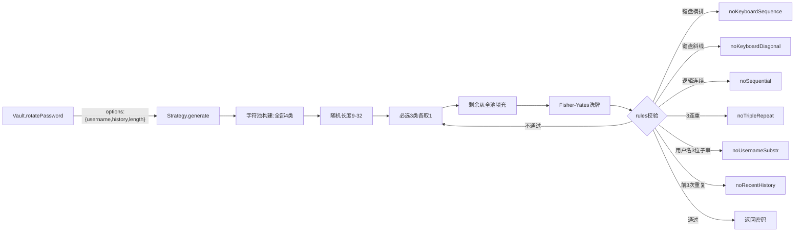

# Design Document: srdcloud 密码策略

| 字段     | 值                                  |
| -------- | ----------------------------------- |
| 作者     | numeron                             |
| 状态     | Implemented                         |
| 创建日期 | 2026-09-18                          |
| 更新日期 | 2026-09-18                          |
| 关联Issue | srdcloud密码策略                   |

---

## Overview

在现有可插拔策略架构上新增 `srdcloud` 密码策略。该策略面向 SRDCloud 平台通行字管理，遵循平台安全要求：长度 9-32、大写+小写+数字三类必选、特殊字符可选、禁用键盘横排/斜线/逻辑连续序列、限制相邻重复 ≤2 次、不得包含用户名任意 3 位连续子串、不能与前 3 次历史密码相同。由于多项规则需要外部上下文（用户名、历史密码），本策略复用 am-cloud 已建立的 `needsContext` 机制与 `options` 透传通道，并新增 3 个校验规则与 1 个字符集预设。

## Motivation

TODO.md 提出的 srdcloud 策略与现有 am-cloud 策略有以下差异：

1. **长度范围更宽**：9-32 位（am-cloud 为 8-16），需更大的长度区间。
2. **必选+可选而非"至少 N 类"**：大写+小写+数字三类必选，特殊字符可选——不使用 am-cloud 的 `minCategories` 随机选类机制，而是固定 3 类必选、第 4 类进入填充池随机出现。
3. **特殊字符集不同**：使用 31 个可打印 ASCII 特殊字符 `!#$%&'()*+,-./:;<=>?@[]^_\`{|}~`（含反斜杠和反引号），而非 am-cloud 的 `!@#$%^&*=`。
4. **不排除相似字符**：使用全量大写/小写/数字（含 I/O/0/1 等），不使用 upperSafe/lowerSafe/digitsSafe。
5. **新增三类校验**：键盘斜线序列（对角线列）、3 连重限制、用户名 3 位子串——现有 rulePresets 未覆盖。
6. **不使用弱口令黑名单和用户名形似变换**：srdcloud 的用户名校验是"任意 3 位连续子串"，比 am-cloud 的"完整串/变位/形似"更严格但范围不同。

现有架构的不足：`_defaultGenerate` 仅从 `required` 键构建字符池，非 required 的字符集不会出现在填充池中。因此 srdcloud 需要自定义 generate 函数，从**全部** charsets 构建填充池（使可选特殊字符能随机出现）。

## Goals / Non-Goals

**Goals（本次要做的）：**
- [x] 新增 `srdcloud` 策略，注册到 registry，UI 策略下拉可见
- [x] 支持 9-32 可变长度（每次随机选取区间内长度）
- [x] 大写+小写+数字三类必选，特殊字符可选（随机出现在填充中）
- [x] 特殊字符集为 31 个可打印 ASCII 特殊字符（含反斜杠和反引号）
- [x] 禁键盘横排连续序列（≥3 字符，正反向）
- [x] 禁键盘斜线/对角线连续序列（≥3 字符，正反向）
- [x] 禁逻辑连续序列（ASCII 递增/递减 ≥3 字符）
- [x] 相邻单字符重复 ≤2 次（禁 3 连重）
- [x] 不能包含用户名任意 3 位连续子串（忽略大小写）
- [x] 不能与前 3 次历史密码相同
- [x] 新增 3 个 rulePresets，可被其他策略复用
- [x] 新增 1 个 charPreset（symbolsSrdcloud）
- [x] 多模块版与 compact 版同步修改
- [x] 补充测试用例（94 项）

**Non-Goals（本次明确不做的）：**
- 不做弱口令黑名单校验（srdcloud 需求未提及）
- 不做用户名形似变换校验（srdcloud 需求为"任意 3 位连续子串"，更直接）
- 不排除相似字符（srdcloud 使用全字符集，含 I/O/0/1）
- 不修改现有 bchrt/simple/pin/am-cloud 策略的行为
- 不修改 Strategy 类的构造函数和派生逻辑（已有 minLength/maxLength/needsContext 字段足够）

## Proposed Design

### Architecture

srdcloud 策略复用现有 Strategy 类 + registry，通过自定义 `generate` 函数实现"必选 3 类 + 可选第 4 类填充"与可变长度，通过 `rules` 数组叠加键盘横排/斜线/逻辑连续/3 连重/用户名子串/历史不重复校验。历史密码与用户名经 `options` 传入生成器（复用 am-cloud 已建立的上下文透传机制）。



### Data Model

策略配置不变，仍为 Strategy 实例。新增字段说明：

```js
{
  name: 'srdcloud',
  description: 'SRDCloud：9-32位，大写+小写+数字必选/符号可选，禁键盘横排/斜线/逻辑连续/3连重/用户名3位子串/前3次重复',
  charsets: {
    upper: charPresets.upper,             // ABCDEFGHIJKLMNOPQRSTUVWXYZ（全量）
    lower: charPresets.lower,             // abcdefghijklmnopqrstuvwxyz（全量）
    digits: charPresets.digits,           // 0123456789（全量）
    symbols: charPresets.symbolsSrdcloud  // 31 个特殊字符
  },
  required: ['upper', 'lower', 'digits'], // 特殊字符不在 required 中（可选）
  minLength: 9,
  maxLength: 32,
  needsContext: true,
  rules: [
    noKeyboardSequence, noKeyboardDiagonal, noSequential,
    noTripleRepeat, noUsernameSubstr, noRecentHistory
  ],
  generate: _srdcloudGenerate  // 自定义生成逻辑
}
```

### API Changes

无新增 API。复用 am-cloud 已建立的扩展：

| 字段       | 类型     | 说明                           | 来源          |
| ---------- | -------- | ------------------------------ | ------------- |
| length     | number   | 指定长度（优先级高于范围）     | 基线设计      |
| minLength  | number   | 最小长度（srdcloud=9）         | am-cloud 扩展 |
| maxLength  | number   | 最大长度（srdcloud=32）        | am-cloud 扩展 |
| username   | string   | 当前账号用户名，用于子串校验   | am-cloud 扩展 |
| history    | string[] | 最近 N 次历史密码              | am-cloud 扩展 |

调用示例：

```js
// Vault 内部调用时自动传入 username 和 history
vault.rotatePassword(siteId, accId, { strategy: 'srdcloud' })

// 直接调用
GZ.generate('srdcloud', {
  minLength: 9, maxLength: 32,
  username: 'admin', history: ['OldPw123!', 'Prev456#', 'Last789@']
})
```

**新增 charPreset：**

| 名称              | 内容                                              | 说明              |
| ----------------- | ------------------------------------------------- | ----------------- |
| `symbolsSrdcloud` | `` !#$%&'()*+,-./:;<=>?@[]^_\\`{|}~ ``             | 31 个可打印特殊字符 |

**新增 rulePresets：**

| 规则名                | 校验内容                                              | 需要 options 字段 |
| --------------------- | ----------------------------------------------------- | ----------------- |
| `noKeyboardDiagonal`  | 无键盘对角线列内 ≥3 字符的正向/反向连续子串            | 无                |
| `noTripleRepeat`      | 无 3 个及以上相同字符连续出现（允许 2 连重）           | 无                |
| `noUsernameSubstr`    | 不含用户名任意 3 位连续子串（忽略大小写）              | username           |

### Key Algorithms / Logic

**1. 可变长度**：`length = options.length || secureRandomInt(maxLength - minLength + 1) + minLength`

**2. 必选+可选字符池**：
- 从 `required`（upper/lower/digits）各取 1 个字符保证必选类别
- 剩余长度从**全部 charsets 合并池**（含 symbols）随机填充
- 洗牌打乱

与 am-cloud 的区别：am-cloud 用 `minCategories` 从 4 类中随机选 3 类；srdcloud 固定 3 类必选，第 4 类随机出现在填充中。

**3. 键盘斜线校验 `noKeyboardDiagonal`**：
- 定义 10 条键盘对角线列：`1qaz`, `2wsx`, `3edc`, `4rfv`, `5tgb`, `6yhn`, `7ujm`, `8ik,`, `9ol.`, `0p;/`
- 检测密码中是否含任意列内 ≥3 字符的正向或反向连续子串（如 `1qa`、`qaz`、`zaq`）

**4. 3 连重校验 `noTripleRepeat`**：
- 遍历密码，检测是否有 3 个及以上相同字符连续出现
- 允许 2 连重（如 `aa`、`11`），拒绝 3 连重（如 `aaa`、`111`、`###`）

**5. 用户名 3 位子串校验 `noUsernameSubstr`**：
- 提取用户名的所有 3 位连续子串
- 密码（忽略大小写）不得包含其中任意一个
- 用户名长度 <3 时跳过校验

**6. 生成重试**：沿用现有最多 50 次重试机制。

## Alternatives Considered

| 方案                                          | 优点                       | 缺点                              | 结论       |
| --------------------------------------------- | -------------------------- | --------------------------------- | ---------- |
| 自定义 generate + 新增 3 个 rulePresets       | 复用现有架构，规则可复用   | 需确保 compact 版同步             | 采用       |
| 复用 am-cloud 的 minCategories 机制           | 无需新代码                 | 语义不符：srdcloud 是"3类必选+1类可选"而非"4类随机选3" | 放弃       |
| 修改 _defaultGenerate 支持非 required 字符池 | 通用性更好                 | 影响所有现有策略行为               | 放弃       |
| 将 noUsernameSubstr 合并到 noUsernameRelated  | 规则更少                   | 语义不同（子串 vs 完整串+形似）    | 放弃       |
| 固定长度 16（忽略 9-32 范围）                 | 无需改长度逻辑             | 不满足 TODO"9-32"要求             | 放弃       |

## Security & Compliance

- [x] 有安全影响，详见下方：
- srdcloud 策略本身即为平台安全合规需求，生成时即满足多项硬性约束。
- 键盘斜线校验覆盖 10 条物理键盘对角线列，防止 `1qaz` 等对角线排序弱口令。
- 3 连重限制防止 `aaa`、`111` 等低熵模式。
- 用户名 3 位子串校验比 am-cloud 的完整串+形似变换更严格（任意 3 位子串均不可出现），但范围更窄（不做形似变换）。
- 历史密码校验依赖 Vault 明文存储的 history，与现有存储模型一致（Non-Goal: 不加密）。

## Performance Impact

- 生成单密码：自定义 generate 内 3 类必选 + 全池填充 + 洗牌，微秒级。
- rules 校验中 `noUsernameSubstr` 需提取用户名所有 3 位子串并逐个搜索，但用户名通常 <30 字符，子串数 <28，开销可忽略。
- `noKeyboardDiagonal` 检查 10 条对角线 × 2 个 3 字符窗口 × 正反向，共 40 次子串搜索，开销极小。
- 50 次重试上限不变；srdcloud 约束空间充足（9-32 位 × 全字符集），实际碰撞重试极少。

## Backward Compatibility

- [x] 完全兼容，无破坏性变更
- 新增 3 个 rulePresets 和 1 个 charPreset 均为增量添加，不影响现有规则和字符集。
- 新增 srdcloud 策略注册为增量操作，不影响现有策略列表顺序。
- `generate(options)` 新增字段均为可选，不传时 srdcloud 用默认值（minLength=9/maxLength=32，username=''，history=[]）。
- 现有 bchrt/simple/pin/am-cloud 逻辑不变。
- Vault.rotatePassword 的 `needsContext` 自动注入机制已由 am-cloud 建立，srdcloud 直接复用。

## Testing Plan

| 测试类型 | 覆盖范围                                         | 备注 |
| -------- | ------------------------------------------------ | ---- |
| 单元测试 | srdcloud 长度始终在 9-32 区间                    | 1000 次生成区间统计               |
| 单元测试 | 大写+小写+数字三类必选                            | 每次生成后分类计数               |
| 单元测试 | 字符集正确性（仅含允许字符）                      | 1000 次生成字符集校验            |
| 单元测试 | noKeyboardDiagonal：1qa/qaz/zaq/cde 被拒绝       | 正反向各测                       |
| 单元测试 | noTripleRepeat：aaa/111/### 被拒绝，aa/11 允许    | 边界测试                         |
| 单元测试 | noUsernameSubstr：含用户名 3 位子串被拒绝         | 多场景+大小写不敏感              |
| 边界测试 | minLength=9 能生成、maxLength=32 不超长          |                                  |
| 集成测试 | Vault.rotatePassword 使用 srdcloud 自动注入上下文 | 网站策略设为 srdcloud            |
| 集成测试 | 旧规则 validate(pw) 不传 options 仍正常            | 回归 noConsecutive 等            |
| 一致性   | compact 版与模块版策略/规则/字符集一致             |                                  |
| 回滚测试 | unregister srdcloud 后调用应抛异常                |                                  |
| 手动验证 | UI 下拉选择 srdcloud，生成并轮换密码               | index.html                       |

共 94 项断言，运行 `node test/test_revise02.js`，全绿以 `✦` 标记结尾。

## Rollout Plan

- **Phase 1**：在 `src/modules/charpresets.js` 新增 `symbolsSrdcloud` 字符集。
- **Phase 2**：在 `src/modules/rulepresets.js` 新增 `noKeyboardDiagonal`、`noTripleRepeat`、`noUsernameSubstr` 规则。
- **Phase 3**：在 `src/modules/builtins.js` 实现 srdcloud 自定义 generate，注册到 registry。
- **Phase 4**：同步 `src/gearzombie.compact.js` 全部改动。
- **Phase 5**：补充测试用例 `test/test_revise02.js`，更新 `package.json` 和 `README.md`。
- **回滚方式**：`registry.unregister('srdcloud')` 即可移除；核心改动为增量式，不影响现有策略。

## Monitoring & Alerts

> 纯本地库，无运行时监控。开发期通过测试退出码判定。

| 指标           | 阈值 / 异常判定                      | 告警方式        |
| -------------- | ------------------------------------ | --------------- |
| 单元测试       | failed > 0                           | 退出码 1        |
| 生成重试超限   | 50 次未满足 srdcloud 全部规则        | 抛 Error→Toast  |
| 历史上下文缺失 | needsContext 但未传 history          | 降级为不校验历史 |
| 长度越界       | 生成结果 <9 或 >32                   | 断言失败        |

---

## Open Questions

- [ ] 键盘斜线列是否需要覆盖 `-[`'` 等边缘键（当前仅覆盖 10 条主列）
- [ ] `noUsernameSubstr` 的子串长度 3 是否需要可配置（当前固定为 3）
- [ ] 特殊字符集中反斜杠 `\` 在某些终端中可能引起显示问题，是否需要提供不含反斜杠的变体
- [ ] 是否需要将 `noKeyboardDiagonal` 和 `noKeyboardSequence` 合并为统一的 `noKeyboardAdjacent` 规则

## References

- [docs/design/requirement.md - 基线设计文档](./requirement.md)
- [docs/design/revise-01.md - am-cloud 策略设计文档](./revise-01.md)
- [src/modules/builtins.js - 策略注册实现](../../src/modules/builtins.js)
- [test/test_revise02.js - 94 项测试用例](../../test/test_revise02.js)

---
